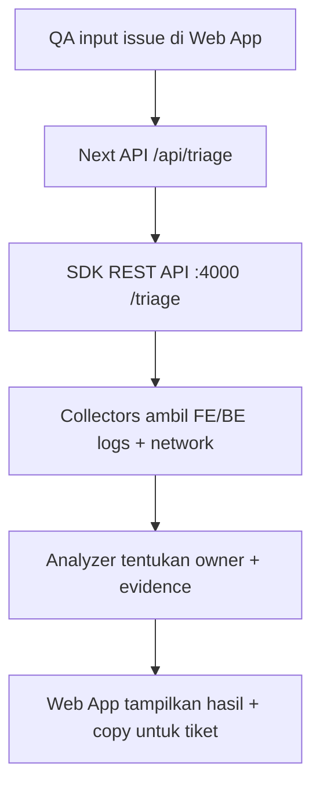

## 1. Gambaran Produk
otracki adalah monorepo yang menyediakan SDK “StackSleuth” untuk triage issue (FE/BE/infra) dan Web App untuk QA agar bisa input masalah lalu mendapatkan rekomendasi owner yang tepat beserta bukti pendukung.
- Tujuan: mengurangi bolak-balik QA ↔ BE ↔ FE dengan analisis cepat berbasis log FE/BE + network response
- Nilai: time-to-owner turun dari jam → menit, tiket lebih berkualitas (trace, request, error headline)

## 2. Fitur Inti

### 2.1 Peran Pengguna
| Peran | Metode Akses | Izin Inti |
|------|--------------|----------|
| QA | Internal web app | Submit deskripsi issue, lihat hasil triage, copy output untuk tiket |
| Engineer (FE/BE) | Internal web app | Re-run triage untuk validasi, lihat ringkasan evidence |

### 2.2 Modul Fitur
1. **Halaman Triage (Home)**: form input issue + environment, tombol analyze, tampilan hasil (owner + evidence)
2. **API Triage (Next Route)**: endpoint untuk Web App memanggil SDK
3. **SDK Triage Server**: REST API Node.js di port 4000 yang menerima request triage dan mengembalikan hasil analisis

### 2.3 Detail Halaman
| Nama Halaman | Nama Modul | Deskripsi Fitur |
|-----------|-------------|-----------------|
| Triage | Form Input | Input teks issue, opsi environment (mis. staging/prod), tombol Analyze |
| Triage | Result Card | Menampilkan Owner (FE/BE/Infra), confidence, ringkasan evidence, tindakan berikutnya |
| Triage | Riwayat Lokal (opsional) | Menyimpan 5 hasil terakhir di localStorage untuk perbandingan cepat |

## 3. Proses Inti
Alur utama:
1. QA reproduce issue dan input deskripsi singkat di Web App
2. Web App memanggil API internal `/api/triage`
3. Route Next meneruskan request ke SDK server (port 4000)
4. SDK menjalankan collector (FE logs, BE logs, network) via provider (mock untuk MVP)
5. Analyzer menyimpulkan owner (FE/BE/Infra) + evidence + next step
6. QA copy hasil dan escalate ke tim yang tepat

## 4. Desain Antarmuka
### 4.1 Gaya Desain
- Arah visual: “forensic console” yang rapi dan modern (gelap, kontras tinggi, fokus pada keterbacaan dan bukti)
- Warna: dasar charcoal/near-black, accent hijau/amber untuk status, merah untuk error
- Tombol: tegas, sedikit rounded, hover state jelas, fokus aksesibilitas
- Tipografi: display font yang tegas untuk judul + mono yang nyaman untuk log/evidence
- Layout: satu halaman, grid 2 kolom di desktop (form kiri, hasil kanan), stack di mobile

### 4.2 Ringkasan Desain per Modul
| Nama Halaman | Nama Modul | Elemen UI |
|-----------|-------------|-----------|
| Triage | Form Input | textarea dengan hint, select environment, tombol Analyze, state loading, error state |
| Triage | Result Card | badge Owner, confidence meter, daftar evidence, CTA “Copy untuk tiket” |

### 4.3 Responsiveness
- Desktop-first: dua kolom, evidence tampil dengan wrapping yang baik
- Mobile-adaptive: satu kolom, tombol besar, spacing lega, scroll area untuk evidence panjang

