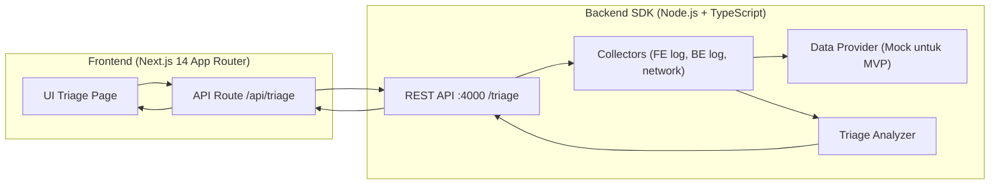
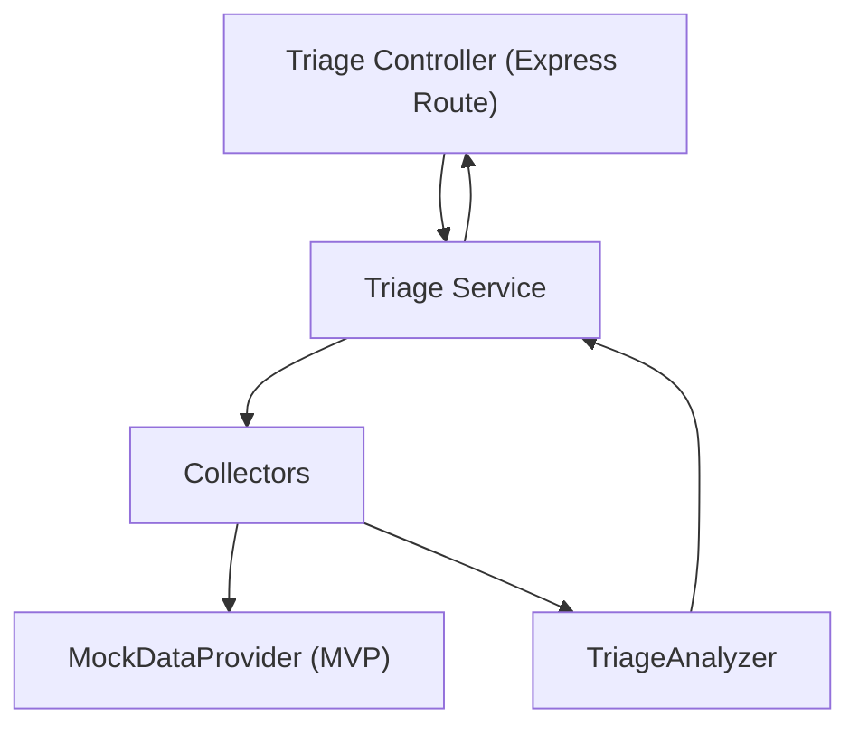

## 1. Desain Arsitektur



## 2. Deskripsi Teknologi
- Monorepo: npm workspaces
- SDK:
  - Runtime: Node.js
  - Bahasa: TypeScript strict
  - HTTP: Express (REST)
  - Output build: `dist/`
- Web App:
  - Next.js 14 (App Router)
  - React 18
  - Tailwind CSS
  - Route handler server-side untuk memanggil SDK

## 3. Definisi Route (Web App)
| Route | Tujuan |
|-------|--------|
| / | Halaman triage: input issue + hasil analisis |
| /api/triage | Proxy server-side menuju SDK |

## 4. Definisi API (SDK)

### 4.1 Endpoint
`POST /triage`

### 4.2 Schema (TypeScript)
```ts
export type TriageOwner = "FE" | "BE" | "INFRA" | "UNKNOWN";

export interface TriageRequest {
  issue: string;
  environment?: "local" | "dev" | "staging" | "prod";
  timestamp?: string;
}

export interface EvidenceItem {
  source: "FE_LOG" | "BE_LOG" | "NETWORK";
  summary: string;
  detail?: string;
}

export interface TriageResult {
  owner: TriageOwner;
  confidence: "low" | "medium" | "high";
  headline: string;
  evidence: EvidenceItem[];
  nextStep: string;
  meta: {
    requestId: string;
    analyzedAt: string;
  };
}
```

### 4.3 Response
- 200: `TriageResult`
- 400: invalid request (missing issue)
- 500: internal error

## 5. Diagram Arsitektur Server (SDK)


## 6. Model Data
MVP tidak membutuhkan database. Data berasal dari provider (mock) yang bisa diganti ke integrasi real (Sentry/ELK/Datadog) di iterasi berikutnya.

