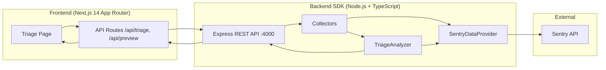

# Architecture

## Overview

StackSleuth is a two-tier system: a **Next.js web app** for QA input and display, and a **Node.js SDK** that fetches Sentry data and runs triage analysis.



## Monorepo layout

```
otracki/                          npm workspaces root
├── apps/stacksleuth-app/         @otracki/stacksleuth-app
│   ├── app/page.tsx              Client-side triage UI
│   ├── app/api/triage/route.ts   Server-side SDK proxy
│   ├── app/api/preview/route.ts  Server-side SDK proxy
│   └── components/ResultCard.tsx Result display + copy-to-ticket
└── packages/stacksleuth-sdk/     @otracki/stacksleuth-sdk
    ├── TriageServer.ts           Express app factory + server start
    ├── TriageAnalyzer.ts         Owner decision engine
    ├── SentryDataProvider.ts     Sentry API client + event parsing
    ├── BeLogCollector.ts         Backend log collection wrapper
    ├── NetworkCollector.ts       Network record collection wrapper
    ├── MockDataProvider.ts       Mock provider (not used in production)
    └── types.ts                  Shared TypeScript interfaces
```

## Request flow

### Triage flow

1. QA submits issue + context filters in the web app
2. `POST /api/triage` (Next.js route handler) validates input
3. Route handler forwards to `POST {SDK_URL}/triage`
4. SDK `TriageServer`:
   - Validates `issue` field
   - Runs `BeLogCollector` and `NetworkCollector` in parallel (side-effect prefetch)
   - Calls `TriageAnalyzer.analyze()`
5. `TriageAnalyzer`:
   - Fetches FE logs, BE logs, and network records via `SentryDataProvider`
   - Builds evidence list from parsed events
   - Runs `decideOwner()` heuristics
   - Adjusts confidence based on input quality
6. Result returned through proxy to UI
7. `ResultCard` renders owner badge, confidence meter, evidence, and copy button

### Preview flow

1. QA clicks Preview in the web app
2. `POST /api/preview` → `POST {SDK_URL}/preview`
3. `SentryDataProvider.previewEvents()` queries Sentry org events API
4. Events ranked by relevance (issue keywords, route match, user hint)
5. UI displays event list; clicking an event sets `debugId` and re-runs triage

## SDK components

### TriageServer

Express application with:

- CORS enabled
- JSON body limit 256 KB
- Auto-loads `.env` from multiple candidate paths
- Instantiates `SentryDataProvider` when `SENTRY_AUTH_TOKEN` is set
- Endpoints: `/health`, `/preview`, `/triage`

### SentryDataProvider

Implements the `DataProvider` interface:

| Method | Purpose |
|--------|---------|
| `getFeLogs()` | Fetch and parse FE events (`service:fe`) |
| `getBeLogs()` | Fetch and parse BE events (`service:be`) |
| `getNetworkRecord()` | Extract network from top-ranked event |
| `getNetworkRecords()` | Extract network from all ranked events |
| `previewEvents()` | List candidate events for UI preview |

**Sentry query building:**

- Uses org events API with `statsPeriod` from `timeWindowMinutes`
- Filters by `project`, `service`, `page.route`, `level` tags
- If `debugId` is a 32-char hex event ID, fetches that event directly

**Event parsing:**

- **FE logs:** exception stack traces, route/level/service tags, event ID
- **BE logs:** same + `request_id` tag when present
- **Network:** parsed from breadcrumbs (fetch/xhr/http) or `http.status` + `request.path` tags

**Resilience:**

- In-memory cache for ranked events (dedupes concurrent requests)
- Automatic retry on Sentry 429 rate limit (1.2s delay)

### TriageAnalyzer

Rule-based owner decision engine. Key rules (in priority order):

| Condition | Owner | Confidence |
|-----------|-------|------------|
| Network 200 + FE error signal | FE | high |
| Network status 0 with error | INFRA | high |
| Network 5xx + BE error logs | BE | high |
| Network 5xx, no BE signal | INFRA | medium |
| Network 4xx | FE | medium |
| FE error, no network | FE | medium |
| BE error logs | BE | medium |
| No clear signal | UNKNOWN | low |

**Input quality scoring:**

- `debugId` → +2, `timeWindowMinutes` → +1, `route` → +1, `userHint` → +1
- Score ≥ 2 → `good`, score 1 → `ok`, else check issue keywords → `ok` or `poor`
- `poor` quality downgrades confidence by one level

### Collectors

Thin wrappers around `DataProvider`:

- `BeLogCollector.collect()` → `provider.getBeLogs()`
- `NetworkCollector.collect()` → `provider.getNetworkRecord()`

Used for parallel prefetch before analysis in `TriageServer`.

## Web app components

### page.tsx

Client component with:

- Issue textarea + template presets
- Sentry filter controls (route, service, level, time window)
- Input quality indicator
- Preview panel with event selection
- Analyze button + loading/error states

### ResultCard.tsx

Displays triage output:

- Owner badge with color coding (FE=lime, BE=amber, INFRA=sky, UNKNOWN=gray)
- Confidence meter (low/medium/high)
- Evidence grouped by source (FE_LOG, BE_LOG, NETWORK)
- Expandable detail sections for stack traces and payloads
- "Copy for ticket" — formatted markdown for Jira/Linear

## Data model

No database. All data is fetched live from Sentry on each request.

```
TriageRequest
  └── issue, environment?, timestamp?, context?
        └── route?, debugId?, userHint?, timeWindowMinutes?, service?, level?

TriageResult
  ├── owner: FE | BE | INFRA | UNKNOWN
  ├── confidence: low | medium | high
  ├── headline: string
  ├── evidence: EvidenceItem[]
  ├── nextStep: string
  └── meta: { requestId, analyzedAt, inputQuality, input }
```

## Technology stack

| Layer | Technology |
|-------|------------|
| Monorepo | npm workspaces |
| SDK runtime | Node.js, TypeScript (ESM) |
| SDK HTTP | Express + cors |
| SDK build | tsc → `dist/` |
| SDK dev | tsx watch |
| App framework | Next.js 14 (App Router) |
| App UI | React 18, Tailwind CSS, lucide-react |
| App fonts | IBM Plex Sans + IBM Plex Mono |
| External data | Sentry REST API |
| Deployment | Railway (concurrently runs both services) |

## Design decisions

1. **Separate SDK service** — keeps Sentry credentials server-side; the Next.js app only needs the SDK URL
2. **Proxy routes** — avoids CORS issues and hides SDK URL from the browser in production
3. **Rule-based analyzer** — predictable, debuggable routing without LLM dependency
4. **Context anchors** — encourages QA to provide route/time/event ID for better Sentry correlation
5. **Preview before analyze** — lets QA pick the exact Sentry event when multiple candidates exist
6. **No persistence** — simpler MVP; results are ephemeral (copy-to-ticket is the output)

## Extension points

To add a new data source (e.g. Datadog, ELK):

1. Implement the `DataProvider` interface in a new file
2. Swap the provider in `TriageServer.createTriageServer()`
3. No changes needed in collectors or analyzer

To add new routing rules:

1. Extend `decideOwner()` in `TriageAnalyzer.ts`
2. Add corresponding evidence parsing in the provider if needed
